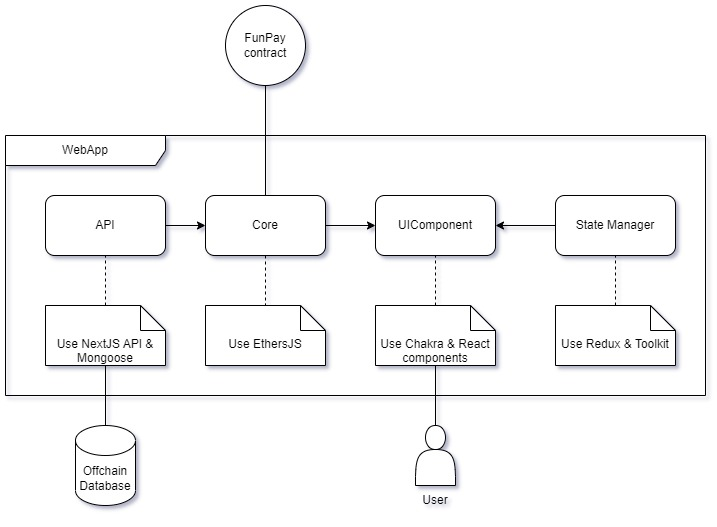

## Introduction
FunPay is an application designed for users to make payments, investments, and disbursements using cryptocurrencies. The application is deployed on the FON Smart Chain platform.

To test this app, you'll need to install the Metamask wallet and exchange FON or any token on [Hieswap](https://hieswap.com/)

**Demo:** [FunPay dApp](https://funpay.a2n.finance)

**Smart Contract:** [FunPay Smart Contract](https://fonscan.io/address/0x0F718444De2eD7c35FFdEDEb476CE1c62b6d0096?tab=contract)

## Features
- [x] Deposit.
- [x] Create batch recurring payments.
- [x] Create batch onetime payments.
- [x] Manage Address book.
- [x] Create invoice.
- [x] Withdraw
- [x] Cancel payment.
- [x] Transfer payment.
- [x] Pay invoice.
- [x] Cancel/Reject/Pause/Active invoice.
- [x] Show user's sent payments.
- [x] Show user's received payments.
- [x] View all invoices.
- [x] Upload .csv.
- [x] Manage user permissions for payments.
- [ ] Reports & Statistics.
- [ ] Pause payment.
- [ ] Create invoice with recurring payement options.
- [ ] Payment SDK.

## Architecture


- Frontend (UI/UX): use NextJS and Chakra UI framework.
- Offchain DB: use Mongo DB.
- Smart contract interaction: use EthersJS to send transactions.
- Wallet Connector: use Metamask API to connect wallet.

We use Solidity and Hardhat to develop smart contracts. For the front-end development, we use NextJS and EthersJS. 
## Prerequisites

To understand source code, you should have basic knowlege of:
- FON smart chain mainnet.
- Solidity
- Hardhat
- NodeJS
- React
- Next JS
- Wagmi
- Linux commands.

## Installation steps
**Step 1: Install Dev environment**

- Install NodeJS (16+)
- Install VisualCode studio.
- Install Solidity & Hardhat addons for VisualCode.

**Step 2: Install libraries**
- Go to each folder
    - ```cd frontend ``` -> ```npm i```
    - ```cd contracts``` -> ```npm i```

**Step 3: Deploy smart contracts**

Go to folder: ```cd contracts```
- Deploy contracts:
    - Use: ```npx hardhat deploy-contract  --network fsc --show-stack-traces ```
- Verify contracts:
    - Use: ```npx hardhat verify --network fsc {contract address}```
- To test smart contracts
    - Use ```npx hardhat test```.

**Step 4: Setup .env**

Setup ENV file in each folder: Frontend, Contracts. 

- ```cp .env.example .env``` and change variable values.


## Commands to start

- To run Backend and Frontend applications in Production mode, use this command: ```npm run build``` and ```pm2 run npm --name "your app name" -- run start```


## Contribution
We welcome any ideas or suggestions to help us make FunPay better. Please do not hesitate to contact us via email at levi@a2n.finance.

## License

This package is released under the BSL 1.1 License.
   


